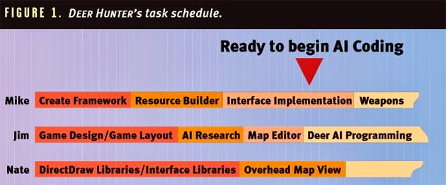

@def title = "컨셉부터 출고까지 세달 : 디어헌터 제작기"
@def hascode = false
@def date = Date(2014, 5, 1)

[From concept to retail in three months: the making of Deer Hunter](https://www.gamasutra.com/view/news/205199/From_concept_to_retail_in_three_months_the_making_of_Deer_Hunter.php)

# 컨셉부터 출고까지 세달 : 디어헌터 제작기

이 기사는 게임 개발자 매거진의 **1998 년 12월판에** 실렸던 내용입니다. 90년대 후반 프로그래머 제임스 보어가 게임으로서 가능성이 별로 없어 보이던 스포츠를 효율적인 병행 개발을 통해 베스트 셀러로 성공 시킨 방법을 공유합니다.

올해초 디어 헌터라는 사냥 시뮬레이션은 3 개월 판매 차트의 상단을 차지함으로써 업계에 충격을 주었다.  디어헌터는 지금까지도 좋은 판매량을 보이고 있습니다.
대부분의 하드 코어 게임 플레이어가 비슷한 내용의 게임들을 플레이 하고 있는 사이,, PC를 문서 작업용이나 솔리테어 게임, 전자메일을 보내는데만 사용하던 많은 컴퓨터 유저가 잠재 시장으로서 존재하고 있었습니다. 파괴광선이나 세계정복같은 소재는 그런 사람들에게 별다른 관심을 끌지 못하였지만, 그들은 즐겁게 플레이할만한 게임이 출시되기를 기다리고 있었습니다.
저는 디어 헌터 같은 장르의 장점을 토로하려는 것은 아닙니다. 그러나 디어 헌터 같은 게임이 가졌던 이점에 대해 몇가지 보여주겠습니다.

- 디어헌터는 사슴 사냥에 사용되는 전략을 진지하게 시뮬레이션 시도한 최초의 게임이었습니다.
- 사냥이란 맥주를 들고 산탄총을 난사하며 숲속을 돌파하면 된다고 생각한다면 당신은 실제 사냥 방법에 대한 지식이 전혀 없는 것입니다. 잘난척 하는 소리를 하기전에 미리 말하자면 저도 디어헌터를 제작 시작하기 전까지 실제 사냥에 대한 지식이 없었고 여러분과 비슷한 착각을 하고 있었습니다.
- 디어헌터는 저렴한 게임입니다. $20의 가격과 그에 $20 수준의 가치를 지니고 있습니다. 많은 사람들이 디어헌터를 2~3배 비싼 가격에 디어 헌터의 10배 이상의 제작비를 들인 게임과 비교하는 경향이 있는데, 디어 헌터의 총 개발 비용은 $75,000 이었습니다.
- 디어 헌터는 일반적인 게이머가 아닌 사람을 대상으로 제작하였습니다. 이는 컨트롤과 게임 플레이가 최대한 간단하게 유지되었다는 것을 의미합니다. 컨트롤과 게임플레이를 간단하게 만든 것은 (제작비를 줄이기 위한)편법이 아니라, 디어 헌터의 타겟 플레이어를 위해 필요한 요구 사항 이었습니다.
- 디어 헌터는 3명의 프로그래머(1명은 대학생 인턴)와 1명의 파트 타임 아티스트로 3개월도 채 안되는 기간에 완성되었습니다.
디어 헌터의 놀라운 판매량에 비해 놀랍도록 적은 인원과 기간으로 제작했다는 것이 가장 흥미로운 내용일 것입니다. 디어헌터의 판매량은 모두들 개발진을 포함하여 모두가 예측 못했던 놀라운 일이었습니다. 하지만 디어헌터의 개발 일정은 우리가 성공적으로 조절한 사항이었습니다.
이 시점에서 당신은 이런말을 할지도 모릅니다. “그래 디어헌터처럼 단순한 게임이 빨리 제작되었다고? 내가 만들고 있는 게임은 훨씬 복잡하고 다양한 기능…. 어쩌구 저쩌구”
그럴 수도 있겠죠., 하지만 압축된 개발 일정 관리(Compact Development Cycle)는 어떤 게임 개발 프로젝트에든 적용될 수 있습니다. 저는 1년에 5개의 게임을 제작하면서 개발 프로세스를 분석하고 적절하게 튜닝할 기회를 가질 수 있었습니다. 1년 6개월이 걸리는 프로젝트라도 마일스톤수립에는 동일한 전략을 사용할 수 있습니다. 물론 더 긴 프로젝트라도 마찬가지이지요. 개발 속도를 높이기 위해서는 특별한 기술이 필요한 것도 아닙니다. 단지 기술이 있다면 당신이 가진 일정에서 더 많은 것을 만들 수 있도록 해주겠지요. 
이 기사에서 저는 우리 개발 사이클에서 두드러진 중점 사항들을 설명할 것입니다. 제가 설명할 중점 사항들 중 몇 가지는 누구나 앓고 있는 상식적인 내용이지만 나쁜 전례나 다른 외부 압력에 의해 무시되는 일이 많습니다. 그리고 제가 설명할 또 다른 사항은 일반적인 개발 방법론과 반대되는 내용입니다. 모든 프로젝트에서 디어헌터의 개발에서 사용한 원칙을 적용할 수 없지만, 디어헌터에서 사용한 이러한 기술들은 Sunstorm에서 히트작 이후에 빠르게 후속작들을 제작에 성공한 원천이었습니다. 

## 강좌1 : 오버디자인 하지 마십시오.

게임 계획은 간단하고 이해하기 쉽게 유지 하는 편이 좋습니다. 전체 게임 내용을 문서화 할 필요는 없습니다. 초기 게임 기획에서 가장 중요한 사항은 각각의 구성요소별 역할을 명확히 제시하는 것입니다. 개별 구성 요소가 어떻게 작동하는지 따지지 말고, 주요 구성요소들이 어떻게 상호작용하는지를 먼저 고려해야 합니다. 다시 말하지만, 구성요소들의 상호작용도 반드시 고정된 문서로 만들 필요는 없습니다. 오히려 구성요소들의 상호작용을 개발하는 과정에서 프로그래머가 이러한 구성요소들의 자연스러운 통신 구조를 찾아내게 될 수도 있습니다. 프로그래머들이 구성 요소간의 상호작용에서 발생하는 문제들을 해결해야 하는 사람이기 때문에 프로그래머가 게임 기획과 코드 양 측면에서 해결책을 찾는게 자연스러운 귀결입니다. 프로그래머가 찾은 해결책이 잘 잘 작동되고 문서화 된다면 다른 팀원이 해결책을 찾기 위해 함께 고민할 이유가 전혀 없습니다. 이러한 경우에 회의를 통해 계획을 세우려 하는 것은 불필요하고 비효율적입니다. 
이 방법론을 적용하는데 주의 사항이 한가지 있습니다. 인터페이스 디자인에서는 이러한 방법론을 사용해서는 안됩니다. 세개의 프로젝트를 진행하면서, 화면의 모든 요소를 상세하게 문서화하는게 개발의 전 과정에서 프로그래머와 아티스트 양쪽 모두에게 엄청나게 도움이 된다는 사실을 배웠습니다. 
이것은 그래픽적 요소를 완벽하게 문서화하라는 이야기가 아니라, 기능상의 요소들을 이야기하는 겁니다. 저는 CorelDraw로 화면들의 모든 요소를 배치하는데 사용합니다. 저는 각각의 화면을 별도의 페이지로 구성하고 모든 버튼에 레이블을 붙이고 기능을 설명합니다. 저는 시각적으로 아름다운 화면을 만들려고 시도하지 않습니다. 문서에 특별히 변경하지 말라고 명시된 경우를 제외하고는 제가 만든 기능과 버튼들을 꾸미고 정렬하는 일은 아티스트의 판단으로 진행합니다. 
완결된 인터페이스 디자인 문서는 게임의 흐름을 정형화 할 뿐만 아니라 인터페이스를 코딩하거나 그리면서 게임플레이에 끼치는 영향에 대해 불필요한 논쟁을 일으키지 않도록 해줍니다. 

## 강좌 2 : 유동적으로, 그리고 병렬로 기획하는걸 두려워하지 마세요

디어 헌터의 최초 아이디어는 최종 완성본보다 훨씬 간단했습니다. 제가 1997년 5월 Sunstorm에 합류했을 때 앞으로 제작할 게임에 대한 간단한 아이디어만 있을 뿐, 사냥에 대한 실제 지식은 전무한 상태였습니다. 제 첫 임무는 사슴 사냥 게임을 기획하는 것이었습니다. 숲속에서 몇시간씩 걷거나 앉아서 숨어다니는 동물들이 나타나길 기다리다가 총을 쏘는 스포츠를 게임으로 기획해야 한다는 사실에 제가 얼마나 흥분되었을지 예상할 수 있을 것입니다. 
초기 기획 아이디어는 디어 헌터 이전에 존재하였던 사냥 게임들과 다르지 않았습니다. `플레이어가 이동하는 경로에 사슴이 나타나면 쏴 죽여버린다.`라는 내용입니다. 개발이 진행되면서 제가 사슴을 추적하는 일과 사냥에 대해 더 많은 지식을 쌓게 되자, 저는 우리 게임의 방향을 아케이드 총쏘기 게임에서 오버헤드 맵뷰와 실시간 장면 생성기를 사용하는 시뮬레이션 게임으로 바꿀 수 있다는 사실을 깨달았습니다. 디어 헌터의 가장 큰 성공 요인은 디어헌터가 최초의 현실적인 사냥 시뮬레이션 게임이라는 점이었습니다. 우리가 가진 유동적인 개발 프로세스는 개발 중간에 우리가 타겟 유저를 시뮬레이션 유저층으로 바꿀 수 있도록 해주었습니다.
어떤 프로젝트들은 확고한 게임 기획이 없어서 실패하지만, 우리의 경우에는 게임 기획에 대한 유연한 접근 방식이 효과적으로 작용하였습니다. 이처럼 유동적인 개발방식은 당신의 다음 프로젝트에도 고려할 가치가 있을지 모릅니다. 물론 그렇다고 해서 3D 슈터를 만들다가 중간에 실시간 전략 게임으로 바꾸라는 의미는 아닙니다. 기획 요소들을 제작 완료 예정일을 기준으로 우선순위를 정하고, 우선순위가 먼저인 기획 요소들을 먼저 만들어보라는 뜻입니다.  
예를들어 사용자 인터페이스의 개발방향이 명확하고, 게임 플레이를 만드는데에는 더 많은 기획이 필요하다면 프로그래머와 아티스트가 인터페이스를 먼저 개발하도록 하고 나머지 개발진이 게임 플레이의 세부적인 내용을 만들어 나가도록 하는 것입니다. 이것이 프로젝트의 병렬 기획의 예입니다. 각각의 구성 요소가 논리적으로 분리되어 있기 때문에 이런 방식으로 개발하는 것이 이치에 맞고, 낭비되는 시간을 줄일 수 있게됩니다. 
게임의 다른 부분을 개발하기 훨씬 전에 시작할 수 있는 내부용 툴 개발은 이처럼 병렬로 개발하는게 필수적이라 할 수 있습니다. 기획 이슈가 해결되지 않고 있을 때, 툴 프로그래머는 게임에 추가될 기능을 고려하여 유연하게 툴을 제작해야 합니다. 파일 형식 따위를 바꾸느라 낭비되는 시간은 상세 게임 기획이 완료될 때까지 프로그래머가 기다릴 경우 낭비되는 시간에 비하면 많은 것이 아닙니다.
개발 도중에 기획내용을 조정하는 유동적 기획을 하려면 다음과 같은 사항을 고려해야 합니다. 상식적인 틀에서 생각 하세요. 저는 프로젝트의 전체 방향을 바꾸라고 하는 것이 아닙니다. 또한 개발 과정에서 나타날 가능성이 있는 모든 문제를 미리 예측해서 피하려는 시도는 성공할 수 없습니다. 대신에 목표를 설정할 때 프로그래머와 아티스트가 스스로 창의적으로 생각하여 도달할 수 있는 범위에서 목표를 설정해야 합니다. 우리 프로젝트를 진행 하는 과정에서 처음 기획보다 더 나은 방식으로 목적을 달성할 방법을 생각해 내는 경우가 종종 있었습니다. 디어헌터에서 가장 재미있었던 사례 중 하나는 라이플 스코프와 쌍안경의 줌 효과였습니다. 처음에는 단순히 픽셀을 두 배로 확대하는 걸로 기획되었지만, 나중에는 처음에 고려하지 못했던 기술을 사용하여 확대시의 세부적인 디테일을 살리는 효과를 사용할 수 있게 되었습니다. 세부 내용이 아니라 목적에 초점을 맞춤으로써 게임 퀄리티를 크게 향상시키면서도 일정을 지킬 수 있는 개발을 할 수 있었습니다. 

## 강좌3 : 지능형 일정관리

병렬 기획을 위해서는 일정관리에 더 많은 신경을 써야 합니다. 지능형 일정관리란 구성 요소별로 완료 계획을 세워서 완성되지 않은 코드에 대한 의존도를 최소화 하는 것입니다. 이것은 우리가 디어 헌터를 매우 빠르게 개발하여 출시할 수 있게 만든 주요 요인 중 하나였습니다

그림1은 디어 헌터 프로젝트의 초기 작업 일정을 나타내고 있습니다.  프로젝트 리더이자 리드 프로그래머였던 마이크 루트는 프레임 워크를 만들고 개선하는 작업과 무기와 사운드 라이브러리를 구축하는 작업을 담당하였습니다.  그는 또한 게임의 아트워크를 관리할 수 있는 리소스에디터를 개발하였습니다. 믿을 수 있는 인턴이었던 네이트는 DiratDraw 그래픽 라이브러리와 유저 인터페이스 개발을 담당하였습니다. 저는 게임 기획과 AI, 사슴의 행동, 지형 제작과 장면 생성(Scene Generation)을 담당하였습니다. 
그림1에서 당신은 게임 기획과 AI 연구가 제가 고급 레벨 프로그래밍이 불가능한 시점에 진행하도록 스케쥴 되어 있다는 사실을 볼 수 있습니다. 마이크와 네이트가 DirectDraw 라이브러리와 리소스 빌더, 기본적인 프로그램 구조를 짜고 있을 때 게임 기획은 대부분 유동적인 상태였습니다.
이러한 구성 요소들이 게임 기획이 어떻게 되던지 상관없이 반드시 필요한 기능이라는 사실을 알고 있었기 때문에 우리는 걱정 없이 작업을 진행할 수 있었습니다. 다른 팀원들이 코딩을 하고 있는 동안 제가 연구를 계속하고 게임 기획 내용을 조절할 수 있도록 시간을 낼 수 있었습니다. 
시간이 흘러 제가 드디어 사슴의 AI를 제작할 준비가 되었을 때, 화면에 사슴을 시각적으로 표현할 수 있을 정도로 개발이 진행되어 있었습니다,

## 강좌 4 : 일정 지연되는 요소를 피해서 코딩하기

어떤 경우에는 일정 관리만으로는 종속성을 최소화하고 모든 사람이 자기가 맡은 일을 끝낼 충분한 시간을 주지 못할 수도 있습니다. 혹은 특정인의 업무가 완료될 때까지 기다리는 동안 다른 사람이 중간에 진행할 업무 자체가 없을 수도 있습니다. 이러한 경우에 가장 좋은 방법은 단순히 문제가 되는 사항을 피해서 코딩하는 것입니다. 디어 헌터의 개발 중 발생하였던 이러한 문제가 발생하였습니다. 
제가 사슴의 인공지능과 행동을 맡고 있을 때 맵뷰 기능을 구현하는데 예상한 것보다 조금 더 많은 시간이 걸리게 되는 문제가 발생하였습니다. (우리처럼 빡빡한 일정으로 작업을 진행할 경우 1주일 지연이 엄청난 차이가 될 수 있습니다.) 사슴의 세계를 볼 수 있는 시각적 요소 없이는 제 일정을 지키기는 불가능했습니다. 
추후 다른 프로젝트를 진행하면서 같은 문제에 봉착하여 저는 동물의 움직임과 반응만을 생성하고 테스트할 수 있는 별도의 응용 프로그램을 제작했습니다. 다음 버젼의 사냥 게임은 좀더 진보된 행동을 보여야 했기 때문에 다음 프로젝트에서는 AI를 프로그래밍하는데 훨씬 더 많은 시간이 필요했습니다. 저는 부동 소수점 좌표 시스템을 지원하는 써드파티 그래픽 라이브러리 Fastgraph를 사용하여 테스트 배드를 만들었습니다. 동물들은 현실적으로 제작된 세계에서 부동 소수점 벡터를 이용하여 이동하였기 때문에 테스트 배드에서의 결과물은 이 후 작업에 유용하게 사용될 수 있었습니다. 
어떤 라이브러리나 툴을 사용할지 선택하는건 중요한 문제가 아닙니다. 테스트 배드와 실제 게임 코드사이에 구분만 명확히 유지한다면 말이죠. 이런 구분을 유지하면 테스트 배드에서 메인 프로젝트로 코드를 옮겨야 하기 때문에 프로그래머들이 깔끔하고 직관적인 코딩을 하도록 만드는 효과가 있습니다. 게임이 점차 복잡해지면서 특정 시점에 이르면 테스트 배드와 실제 프로젝트사이의 호환성이 거의 없어질 수 있습니다. 반드시 필요한 경우가 아니라면 절대로 그렇게 분리된 2개의 프로젝트를 유지하려 하지 마세요. 실제 프로젝트로 코드를 옮기고 테스트 배드는 버린채로 작업을 진행해야 합니다. 테스트 배드는 목적을 위한 도구일 뿐이며, 유용성이 없어진다면 가차없이 폐기해야 합니다. 메인 프로젝트와 연관성 없는 피쳐를 깔끔하게 만든다고 시간을 낭비하지 마세요. 지저분하더라도 빠르게 만드는게 핵심입니다.

## 강좌 5 : 의미있는 마일스톤 만들기

프로젝트 개발 과정의 세부 내용을 보지 못하는 사람들이 시각적으로 보여줄 마일스톤을 원하는 경우가 많습니다. 그러나 대부분의 경우 겉보기에는 50%밖에 완성 안되어 보이는 게임이 90%이상 개발 완료된 상태이거나 그 반대일 경우가 많습니다. 프로젝트 관리자가 이점을 이해하는게 중요합니다. 가장 간단한 해결책은 마일스톤을 정할 때 기획자, 아티스트, 프로그래머를 함께 참여시키는 것입니다. 실무를 담당한 사람들이 업무 부하를 나누기 위한 적절한 마일스톤 설정법을 본능적으로 알 수 있기 때문입니다. 이렇게 하는게 처음부터 모든 담당자들의 책임 영역을 명확히 하는데도 큰 도움이 됩니다. 
저는 두 가지 경우를 모두 본적이 있습니다. 관리자가 혼자 마일스톤을 설정하려고 할 때 그 결과는 종종 `너무 쉽거나` 혹은 `달성하기 거의 불가능`한 두 가지 중 하나에 속하는 마일스톤들의 연속이 되기 마련입니다. 반면 게임 기획의 기술적인 측면을 알고 있는 사람이 마일스톤 설정에 참여하면 조금 더 현실적인 마일스톤이 설정되게 됩니다. 

제가 여태까지 이야기한 내용은 대부분 프로젝트 중 기획과 관련된 부분들입니다. 사실대로 말하자면, 위의 이야기들만이 디어 헌터의 개발 일정에서 특별했던 점들입니다. 그 외의 부분은 모두 일반적인 방법론을 적용하였습니다. 솔리드 객체 지향 설계 원칙.(또는 C 프로그래머를 위한 단단한 구조적 프로그래밍 기술), 주의 깊은 프로그래밍과 성실한 노력. 
코드의 재사용성이나 안정성에 대한 문제가 생기지 않겠나? 라는 의문이 생길 수도 있을 것입니다. 그러나 기획에 걸리는 시간을 최소화하는 게 반드시 코드의 재사용성이나 안정성을 침해하게 되는 것은 아닙니다. 디어 헌터 프로젝트에서 사용된 코드들이 또 다른 규모가 큰 게임인 오리 사냥, 거위 사냥을 제작하는데 사용되었다는 것을 보면 코드의 재사용성이나 안정성이 충분하였다는 점을 알 수 있습니다. 디어 헌터의 성공은 우리가 전혀 예상하지 못한 것이었지만, 디어 헌터 엔진의 코드를 이용하여 우리는 디어 헌터보다 훨씬 개선된 다른 게임들을 만들 수 있었고, 디어 헌터는 이제 MAC버전까지 제작되고 있습니다. 이런점들을 볼 때 디어헌터의 코드가 견고하게 잘 설계되었다는 것을 알 수 있습니다. 거창한 기획 문서를 만들지 않고도 개별 프로그래머의 시간을 객체지향형 프로그래밍 기술에 집중한 결과 이처럼 견고한 코드가 완성될 수 있었습니다.  
기획/설계 시간이 근본적으로 오버헤드라는 점을 명심하세요. 최대한 빨리 팀을 구성하고 업무를 시작해야 그들이 가장 중요한 작업을 하게 될 시간이 생깁니다. 바로 게임을 만드는 일이지요. 